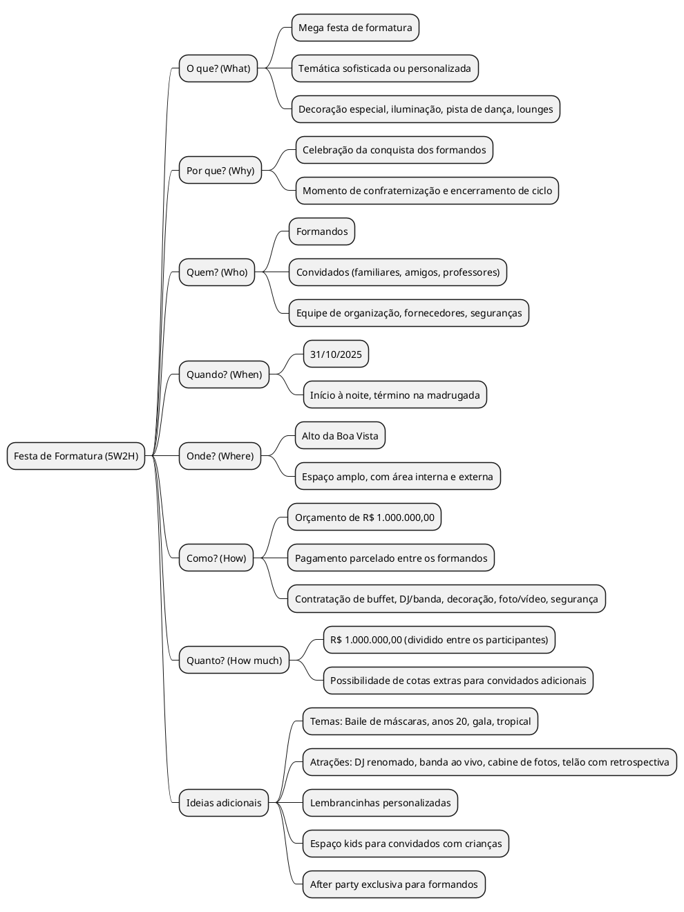

```plantuml
@startmindmap
* Festa de Formatura (5W2H)
** O que? (What)
*** Mega festa de formatura
*** Temática sofisticada ou personalizada
*** Decoração especial, iluminação, pista de dança, lounges
** Por que? (Why)
*** Celebração da conquista dos formandos
*** Momento de confraternização e encerramento de ciclo
** Quem? (Who)
*** Formandos
*** Convidados (familiares, amigos, professores)
*** Equipe de organização, fornecedores, seguranças
** Quando? (When)
*** 31/10/2025
*** Início à noite, término na madrugada
** Onde? (Where)
*** Alto da Boa Vista
*** Espaço amplo, com área interna e externa
** Como? (How)
*** Orçamento de R$ 1.000.000,00
*** Pagamento parcelado entre os formandos
*** Contratação de buffet, DJ/banda, decoração, foto/vídeo, segurança
** Quanto? (How much)
*** R$ 1.000.000,00 (dividido entre os participantes)
*** Possibilidade de cotas extras para convidados adicionais
** Ideias adicionais
*** Temas: Baile de máscaras, anos 20, gala, tropical
*** Atrações: DJ renomado, banda ao vivo, cabine de fotos, telão com retrospectiva
*** Lembrancinhas personalizadas
*** Espaço kids para convidados com crianças
*** After party exclusiva para formandos
@endmindmap
```
