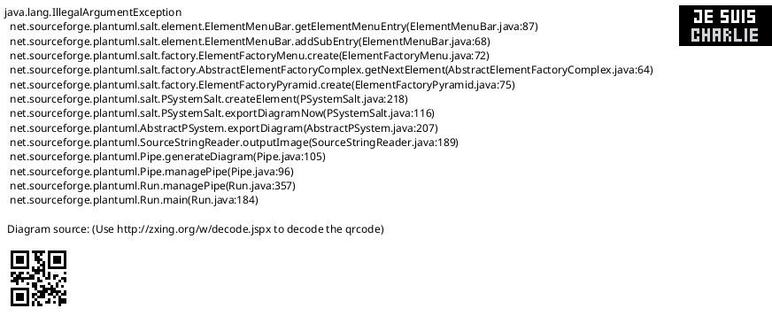
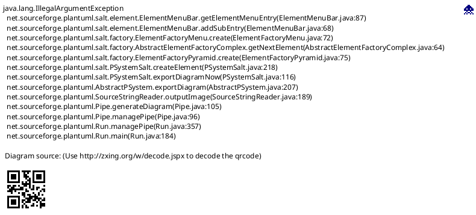
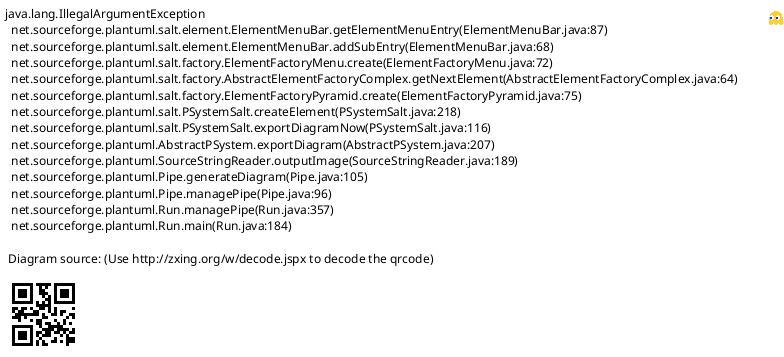
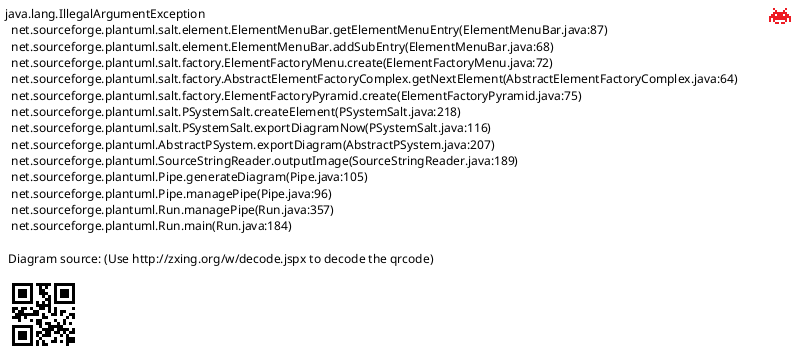
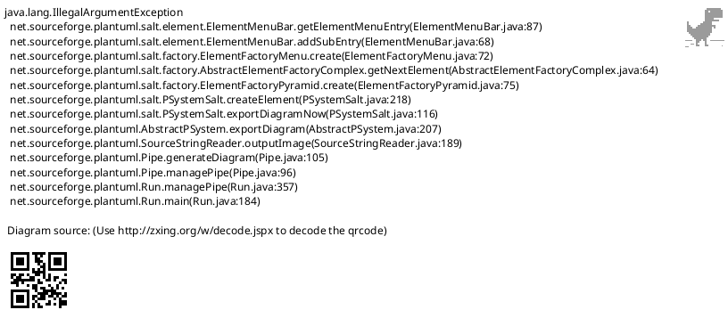

# Protótipo de Baixa Fidelidade - Aplicativo Web E-commerce

## Introdução

Este documento apresenta os protótipos de baixa fidelidade do aplicativo web de e-commerce, desenvolvidos utilizando Salt PlantUML. Os wireframes foram criados com base na análise de tarefas realizada e nas histórias de usuário levantadas, focando nas principais funcionalidades identificadas: gestão de pedidos, controle de estoque e atendimento ao cliente.

## Metodologia

Os protótipos foram desenvolvidos utilizando a linguagem Salt PlantUML, que permite criar wireframes interativos de forma rápida e colaborativa. A abordagem seguiu os princípios de Design Thinking, priorizando as necessidades dos usuários identificadas na análise de tarefas.

## Protótipos de Baixa Fidelidade

### Tela de Login

### Tela Principal - Dashboard Vendedor

### Tela de Registro de Pedido

### Tela de Consulta de Estoque

### Tela de Aprovação de Descontos - Gerente

### Tela de Relatórios

### Tela de Rastreamento - Cliente

```plantuml
@startsalt
{+ <b>Rastreamento de Pedido - Cliente
  .
  {* <b>Meu Pedido #12345
    .
    // US07: Rastrear pedido em tempo real //
    <b>Status do Pedido:
    .
    ‚úÖ Pedido Confirmado (23/09 - 14:30)
    ‚úÖ Pagamento Aprovado (23/09 - 14:35)
    🔄 **Em Preparação** (23/09 - 15:00)
    ‚è≥ Em Transporte (Previs√£o: 24/09)
    ‚è≥ Entregue
    .
    <b>Detalhes:
    Produto: Produto A (Qtd: 2)
    Valor: R$ 150,00
    Entrega prevista: 25/09/2025
    .
    // US08: Solicitar trocas via chat //
    [ 💬 Abrir Chat ] [ 🔄 Solicitar Troca ]
  }
}
@endsalt
```

### Tela de Chat de Suporte - Cliente

### Fluxo de Navegação

```plantuml
@startsalt
{+ <b>Fluxo Principal de Navegação
  .
  {* <b>Mapa de Telas
    .
    [Login] -> [Dashboard]
    .
    [Dashboard] -> [Novo Pedido]
    [Dashboard] -> [Consultar Estoque] 
    [Dashboard] -> [Relatórios]
    .
    [Novo Pedido] -> [Buscar Cliente]
    [Novo Pedido] -> [Aplicar Desconto] -> [Aprovação Gerente]
    .
    [Cliente] -> [Rastrear Pedido]
    [Cliente] -> [Chat Suporte]
  }
}
@endsalt
```

## Mapeamento com Histórias de Usuário

| Tela | História de Usuário | Funcionalidade Principal |
|------|-------------------|-------------------------|
| Dashboard | US01 | Busca rápida de clientes |
| Registro de Pedido | US02 | Aplicar descontos personalizados |
| Consulta Estoque | US03, US06 | Estoque em tempo real e alertas |
| Aprovação Descontos | US04 | Aprovação de descontos pelo gerente |
| Relatórios | US05 | Exportar relatórios por período |
| Rastreamento | US07 | Rastrear pedido em tempo real |
| Chat Suporte | US08 | Solicitar trocas via chat |

## Considerações de Usabilidade

### Pontos Fortes Identificados:
- **Busca intuitiva**: Campo de busca prominent na tela principal
- **Feedback visual**: Status claros para estoque (ESGOTADO, CRÍTICO)
- **Fluxo simplificado**: Processo de pedido em etapas claras
- **Notificações**: Alertas visuais para ações importantes

### Melhorias Propostas:
- **Responsividade**: Adaptar layouts para dispositivos móveis
- **Acessibilidade**: Adicionar indicadores para usuários com deficiências
- **Performance**: Otimizar carregamento de listas grandes
- **Validação**: Feedback imediato em formulários

## Próximos Passos

1. **Validação com usuários**: Testar os wireframes com as personas identificadas
2. **Refinamento**: Ajustar com base no feedback coletado
3. **Prototipagem interativa**: Evoluir para protótipos de alta fidelidade
4. **Desenvolvimento**: Usar como base para implementação

## Conclusão

Os protótipos de baixa fidelidade apresentados cobrem todas as funcionalidades críticas identificadas na análise de tarefas, priorizando a usabilidade e eficiência dos fluxos principais. A utilização do Salt PlantUML permitiu uma prototipagem rápida e colaborativa, facilitando discussões com a equipe e stakeholders.

## Referências

> PlantUML Salt. Disponível em: https://plantuml.com/salt

> Material Design Guidelines. Disponível em: https://material.io/design

> Nielsen, J. Usability Engineering. Academic Press, 1993.

## Autor(es)

| Data     | Versão | Descrição                            | Autor(es)                |
| -------- | ------- | -------------------------------------- | ------------------------ |
| 24/09/25 | 1.0     | Criação do documento                 | Equipe de UX/UI          |
| 24/09/25 | 1.1     | Adição dos wireframes Salt PlantUML  | Equipe de UX/UI          |
| 24/09/25 | 1.2     | Mapeamento com histórias de usuário  | Equipe de UX/UI          |
