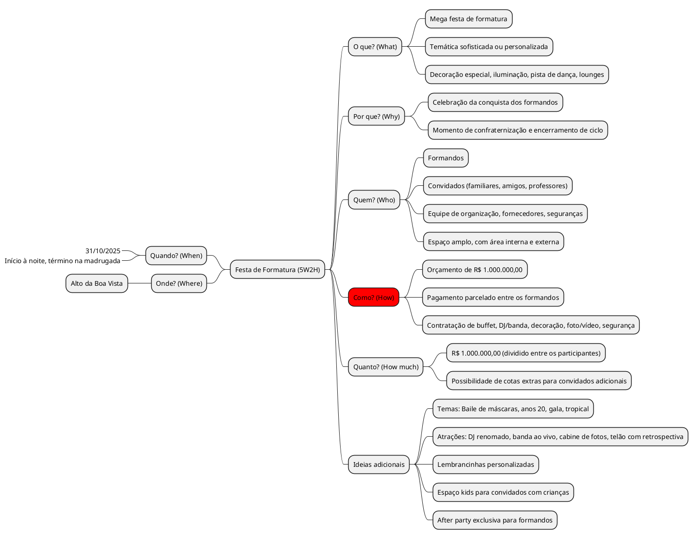

# Aulas

Aula | Conteúdo
: --- | --- : 
**__01__ - 06/08/25** | :material-check: Apresentação da Disciplina   :material-check: Processo de Desenvolvimento  - [Do Cascata ao Ágil](../assets/Aulas/Do%20Cascata%20ao%20Ágil%20-%20Front-End.pdf)
**__02__ - 13/08/25** | :material-check: Configuração de [Ambiente de Desenvolvimento](https://liveestacio-my.sharepoint.com/:w:/g/personal/00661711722_professores_ibmec_edu_br/EU2fCcJwgTFLvWNyOSUtNWABnf7xw5XPoNRumYUMMtNMwA?e=bIE0li)
**__03__ - 20/08/25** | :material-check: [Metodologias Ágeis](../assets/Aulas/Scrum.pdf)
**__04__ - 27/08/25** | [Scrum](../assets/Aulas/Mapa+do+Scrum+Framework+utilizado+nas+aulas.pdf)   :material-check: Roteiro Git
**__05__ - 03/09/25** | :material-check: Apresentação de Tema do Projeto, Principais Funcionalidades do Projeto, App Web Similares   :material-check: Site Mkdocs    :material-check: Configuração repositório Github   :material-check: Design Thinking
**__06__ - 10/09/25** | IbmecDay
**__07__ - 17/09/25** | :material-check: [Brainstorm](../assets/Aulas/O%20processo%20de brainstorm.pdf)   :material-check: [Mapa Mental](../assets/Aulas/Mapa%20Mental.pdf)   [Análise de Tarefas - AHT](../assets/Aulas/Análise%20de%20Tarefas.pdf)   - [Roteiro](./Roteiros/07_epics_features_user_stories.md) 
**__08__ - 24/09/25** | :material-check: Protótipo de Baixa Fidelidade
**__09__ - 31/09/25** | :material-check: AP1 - Apresentação

<!--
| Aula          - | Conteúdo |
| ---- | -------- |
|__01__ - 04/08/25 -- | - Apresentação da Disciplina   - Processo de Desenvolvimento  - [Do Cascata ao Ágil](../assets/Aulas/Do%20Cascata%20ao%20Ágil%20-%20Front-End.pdf) |
|__02__ - 11/08/25  |    - Configuração de [Ambiente de Desenvolvimento](https://liveestacio-my.sharepoint.com/:w:/g/personal/00661711722_professores_ibmec_edu_br/EU2fCcJwgTFLvWNyOSUtNWABnf7xw5XPoNRumYUMMtNMwA?e=bIE0li) |
|__03__ - 18/08/25   | - [Scrum](../assets/Aulas/Mapa+do+Scrum+Framework+utilizado+nas+aulas.pdf) |
|__04__ - 25/08/25 | - Site Mkdocs   - Roteiro Github   - Configuração repositório Github   - Design Thinking|

|__05__ - 17/03/25   | - Apresentação de Tema do Projeto   - Principais Funcionalidades do Projeto   - [User Stories](../assets/Aulas/Scrum.pdf)  |
|__06__ - 24/03/25   | -    - [Brainstorm](../assets/Aulas/O%20processo%20de brainstorm.pdf)   - [Mapa Mental](../assets/Aulas/Mapa%20Mental.pdf) |
|__07__ - 31/03/25   | - Documento de Visão   - Protótipo de baixa fidelidade   - [Análise de Tarefas - AHT](../assets/Aulas/Análise%20de%20Tarefas.pdf)   - [Roteiro](https://jonh-carvalho.github.io/PFE_25.1_8001/_Disciplina/Roteiros/EpicsFeaturesUserStories/) |
|__08__ - 07/04/25   | AP1 |
|__09__ - 14/04/25   | [Avaliação de Interfaces](../assets/Aulas/Avaliação_de_Interfaces.pdf)   - [Introdução ao React](../assets/Aulas/Introducao-ao-Reactjs.pdf)|
|__10__ - 21/04/25   | Feriado |
|__11__ - 28/04/25   | React -Sprint II |
|__12__ - 05/05/25   | React - |
|__13__ - 12/05/25   | React - Sprint III - Site HTML/CSS |
|__14__ - 19/05/25   | React - |
|__15__ - 26/05/25   | React - Sprint IV - React/Componentes |
|__16__ - 02/06/25   | React |
|__17__ - 09/06/25   | React - Sprint V |
|__18__ - 16/06/25   | AP2 - Apresentação |
|__19__ - 23/06/25   | --- |
|__20__ - 30/06/25   | AS |
| __10__ - 10/10/24   |  | 
| __11__ - 17/10/24   | App React Vite - [Componentes](../_Disciplina/Roteiros/React/Componentes.md) |
-->